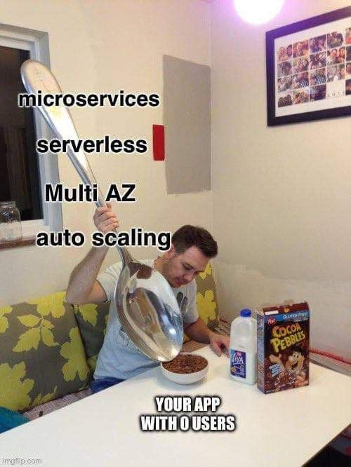

# My first Twitter bot

## Project goal and overview
That's me again! This time I decided to create a simple bot that should periodically gather air parameters data using [airly](https://airly.org/) API, briefly analyze it, store it in a database and finally post a summary tweet. I am also using Docker to containerize it and to place it on external server to run (the server to be chosen yet). 

## Motivation
I am prepairing this project to boost my API and containerization skills. Maybe it doesn't seem that complex, but I felt like I needed to have my own sandbox to take care of. That's my first project to run on production-like environment, so I put the most effort on proper and reliable setup of such things:
 - to run it on external machine and execute periodically,
 - to place API secrets the right way, so that they are securely stored,
 - to properly setup a database.
This knowledge will be essential part of future bigger projects!

## Technologies used
 - Docker,
 - API,
 - External server use.

  

  

  

 
